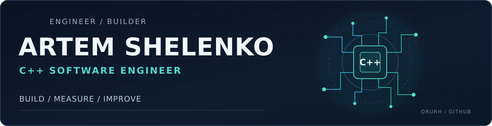

  

  <a href="https://github.com/Orurh?tab=repositories">Projects</a> ·
  <a href="https://t.me/ArtemNordic">Telegram</a> ·
  <a href="https://github.com/Orurh/certificates">Certificates</a>

### Hello, I'm Artem 👋

I'm a **C++ software engineer** working across systems programming, performance-critical code, device integration, and backend services. I enjoy solving practical engineering problems and turning ideas into reliable, efficient, maintainable software.

I like learning new technologies and domains, whether the challenge comes from robotics, infrastructure, simulation, or something entirely different.

### Selected projects

| Project | What it does |
| --- | --- |
| **[PatchCourt](https://github.com/Orurh/PatchCourt)** | Diff-aware architecture review for C++ projects. Separates new risks from existing technical debt and generates evidence-based review artifacts and SARIF. **Go · C++ architecture · Tooling** |
| **[Causal-SLAM](https://github.com/Orurh/Causal_SLAM)** | Experimental temporal integrity diagnostics for LiDAR/IMU SLAM pipelines. Checks timing and sensor compatibility before downstream fusion. **C++17 · ROS 2 · Robotics** |
| **[Courier Platform](https://github.com/Orurh/Service-courier-platform-go)** | HTTP API and Kafka-backed worker for delivery management, with PostgreSQL, metrics, tests, and CI. **Go · Kafka · PostgreSQL** |

### Engineering highlights

- **20–40× faster simulation:** optimized a fire-propagation model using CUDA, spatial hashing, and GPU memory optimizations.
- **Systems integration:** developed multi-camera control and high-throughput image acquisition, synchronized with LiDAR/IMU and GPS telemetry.
- **End-to-end ownership:** from requirements and design to implementation, debugging, and delivery.

*Commercial examples are high-level descriptions; proprietary source code is not published.*

### Tools & technologies

**Core:** `C++` · `C` · `Go` · `Python` · `STL` · `Multithreading` · `CUDA`  
**Platforms:** `Linux` · `CMake` · `Git` · `Docker` · `Bash` · `ROS 2`  
**Services & data:** `gRPC` · `HTTP APIs` · `PostgreSQL` · `Kafka`  
**Engineering:** `Profiling` · `Sanitizers` · `Testing` · `Code review`

<b>Коротко обо мне — на русском</b>

 

C++-разработчик. Занимаюсь задачами на стыке системного программирования, производительности, интеграции оборудования и backend-разработки. Работал с CUDA, многопоточностью, потоками данных, ROS и Go. Люблю изучать новые технологии, разбираться в устройстве систем и доводить решения до рабочего результата.

---

  Build thoughtfully. Measure what matters. Keep improving. 
  <a href="https://t.me/ArtemNordic">Let's talk on Telegram ↗</a>

